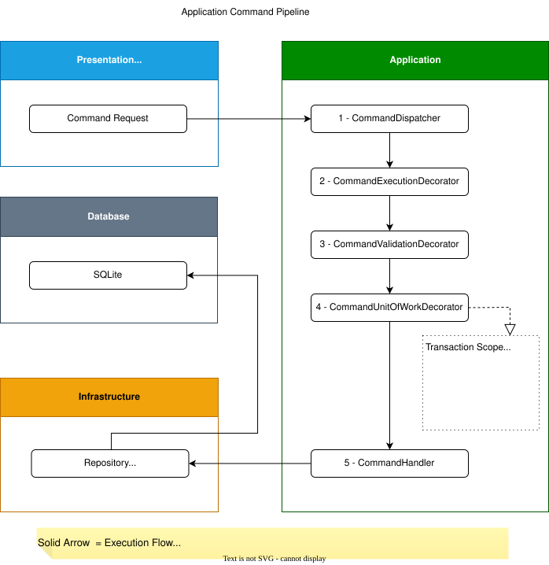
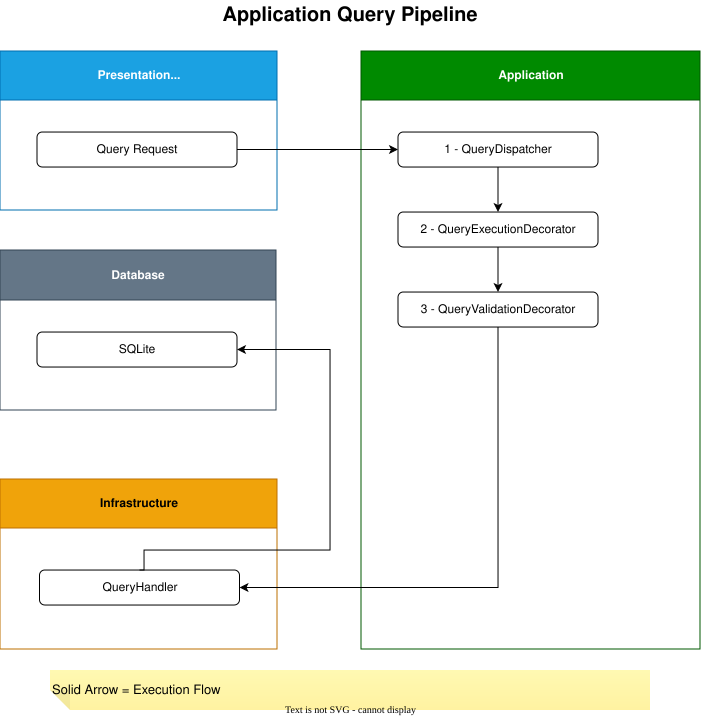

# WhoAmI.Application

## Overview

This application is designed following the principles of [**Domain-Driven Design (DDD)**](https://www.domainlanguage.com/), [**Clean Architecture**](https://blog.cleancoder.com/uncle-bob/2012/08/13/the-clean-architecture.html), [**SOLID**](http://butunclebob.com/ArticleS.UncleBob.PrinciplesOfOod), and [**Command Query Responsibility Segregation (CQRS)**](https://martinfowler.com/bliki/CQRS.html).

The Application layer depends only on the Domain layer and a minimal set of framework used for dependency injection. It has no dependency on Infrastructure, databases, external services, or presentation frameworks.

All use cases are organized by aggregate under the Features directory.

The Application layer is persistence-agnostic. It defines abstractions required by the use cases, while all database access is implemented by the Infrastructure layer.

---

## Dependencies

The Application layer directly references only:

- WhoAmI.Domain
- Microsoft.Extensions.DependencyInjection
- Scrutor

It never references:

- Infrastructure
- Entity Framework Core
- ASP.NET Core
- Spectre.Console
- Serilog
- Any persistence technology

---

## Design Principles

The Application layer is responsible for orchestrating use cases.

It does not contain persistence logic, presentation logic, or infrastructure concerns.

Its responsibilities include:
- Orchestrating use cases
- Dispatching commands and queries
- Validating requests
- Managing transactions through the [**Unit of Work**](https://martinfowler.com/eaaCatalog/unitOfWork.html)
- Producing application results
- Publishing execution information for observability

Persistence and external integrations are delegated to the Infrastructure layer.

---

## Features

### Commands

A command feature typically consists of:
- Command
- Validator
- Handler
- Response (optional)

Example:
```
WhoAmI.Application
 └── Features
     └── Profiles
         ├── CreateProfile
         │   ├── CreateProfileCommand.cs
         │   ├── CreateProfileCommandHandler.cs
         │   ├── CreateProfileCommandValidator.cs
         │   └── CreateProfileResponse.cs
         └── UpdateEmail
             ├── UpdateEmailCommand.cs
             ├── UpdateEmailCommandHandler.cs
             └── UpdateEmailCommandValidator.cs
```

### Queries

A query feature typically consists of:
- Query
- Validator (optional)
- Response

Example:
```
WhoAmI.Application
 └── Features
     └── Profiles
         ├── GetProfileByEmail
         │   ├── GetProfileByEmailQuery.cs
         │   ├── GetProfileByEmailQueryValidator.cs
         │   └── GetProfileByEmailResponse.cs
         └── ListProfiles
             ├── ListProfilesQuery.cs
             └── ListProfilesResponse.cs
```

Query handlers are intentionally implemented in the Infrastructure layer because queries interact directly with the read model. This keeps the Application layer independent of persistence technologies while allowing multiple query implementations such as EF Core, Dapper, or raw SQL.

---

## Dispatchers

Commands and queries are executed through dedicated dispatchers.
- ICommandDispatcher
- IQueryDispatcher

The dispatchers resolve the appropriate handlers through dependency injection and apply the configured decorator pipeline before invoking the underlying handler.

---

## Pipeline

### Command Pipeline

As a CQRS application, Commands represent operations that modify the system state.
Commands are executed through the following pipeline:

<p align="center">
  
</p>

Commands are processed through a decorator pipeline before reaching their handlers. Each decorator has a single responsibility and handles a specific cross-cutting concern, such as logging, validation, or transaction management.

The command pipeline is composed of the following decorators:
- `CommandExecutionDecorator` and  `CommandExecutionDecoratorOfT`, records execution information for logging and observability.
- `CommandValidationDecorator` and `CommandValidationDecoratorOfT`, validates incoming commands before execution.
- `CommandUnitOfWorkDecorator` and `CommandUnitOfWorkDecoratorOfT`, executes the handler inside a Unit of Work and commits the transaction when the operation succeeds.

Each decorator is available in two versions, one for commands that do not return a value and another generic implementation (`OfT`) for commands that return a result.

### Query Pipeline

The query pipeline consists of two decorators:
- QueryExecutionDecorator
- QueryValidationDecorator

Queries are executed through the following pipeline:

<p align="center">
  
</p>

Unlike commands, queries do not modify the application state and therefore do not require transaction management.

---

## Validation

Commands and queries may define validators responsible for verifying application-level rules before a handler is executed.

Validation is performed by the corresponding validation decorators, ensuring that invalid requests never reach the underlying handlers.

Business invariants remain the responsibility of the Domain layer.

Application validation ensures that requests are well-formed and complete, while domain validation protects business invariants and prevents the domain model from entering an invalid state.

---

## Result Pattern

Application operations communicate business failures through the Result pattern instead of using exceptions for control flow.

Operations return either `Result` or `Result<T>`. On failure, the result contains one or more Error instances.

Each `Error` contains:
- Code
- Message
- Metadata (optional)

The optional `Metadata` dictionary allows additional context to be attached to an error without changing its structure.

This approach:
- avoids exception-based control flow;
- provides consistent error handling across different presentation layers;
- allows presentation layers to map application results into user-facing responses;
- preserves structured information for logging and diagnostics.

---

## Observability

### Logging

Execution information includes:
- Operation name
- Execution time
- Serialized request
- Business errors
- Unhandled exceptions

This information can be consumed by logging providers such as Serilog, Seq, or Elasticsearch without coupling the Application layer to a specific logging framework.

---

## Related Documentation

- [Architecture](../../docs/architecture/README.md)
- [WhoAmI — Project Overview](../../README.md)
- [WhoAmI.Domain](../WhoAmI.Domain/README.md)
- [WhoAmI.Infrastructure](../WhoAmI.Infrastructure/README.md)

---

## References

- [Domain-Driven Design](https://www.domainlanguage.com/) — Eric Evans
- [Clean Architecture](https://blog.cleancoder.com/uncle-bob/2012/08/13/the-clean-architecture.html) — Robert C. Martin
- [SOLID Principles](http://butunclebob.com/ArticleS.UncleBob.PrinciplesOfOod) — Robert C. Martin
- [CQRS](https://martinfowler.com/bliki/CQRS.html) — Martin Fowler
- [Unit of Work](https://martinfowler.com/eaaCatalog/unitOfWork.html) — Martin Fowler

---

Built with ❤️ on Linux using JetBrains Rider.

> "These things I have spoken unto you, that in me you might have peace. In the world you shall have tribulation: but be of good cheer; I have overcome the world."
>
> — John 16:33
