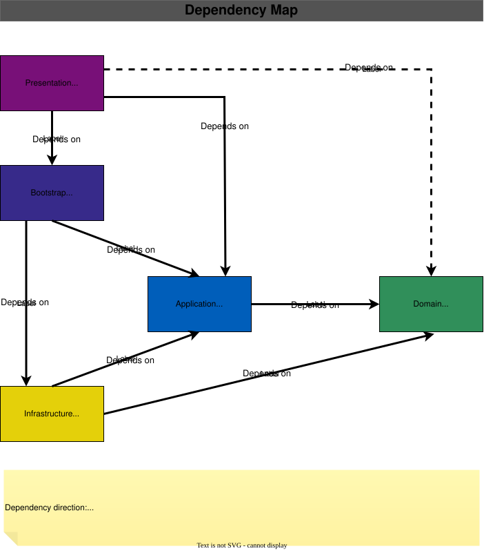

# WhoAmI.Domain

The **WhoAmI.Domain** project contains the core business model of the WhoAmI application.

It defines the domain concepts, business rules, invariants, value objects, entities, aggregate roots, domain events, and domain-specific exceptions that represent the business itself.

The Domain layer is independent of application workflows, persistence implementations, presentation technologies, and external services.

It follows principles from [**Domain-Driven Design (DDD)**](https://www.domainlanguage.com/) and [**Clean Architecture**](https://blog.cleancoder.com/uncle-bob/2012/08/13/the-clean-architecture.html), with the business model kept at the center of the system.

---

## Overview

The Domain layer answers the question:

> **What is a valid state of the WhoAmI domain, and how can that state change?**

It contains:

- Aggregates and aggregate roots
- Entities
- Value objects
- Domain events
- Domain exceptions
- Domain constraints
- Domain guards
- Shared domain abstractions

The Domain layer does **not** contain:

- Application use cases
- Commands or queries
- Command or query dispatching
- Application pipelines
- Persistence implementations
- Entity Framework Core configurations
- Logging
- CLI or API concerns
- Infrastructure services

This separation allows the business model to remain independent of technical implementation details.

---

## Domain Structure

The current Domain project is organized around the Profiles domain and shared domain building blocks:

```text
WhoAmI.Domain
├── Profiles
│   ├── Profile.cs
│   ├── Events
│   │   ├── EmailUpdatedEvent.cs
│   │   └── ProfileCreatedEvent.cs
│   ├── Exceptions
│   │   ├── InvalidEmailException.cs
│   │   ├── InvalidLengthException.cs
│   │   └── InvalidUrlException.cs
│   └── ValueObjects
│       ├── Email.cs
│       ├── FirstName.cs
│       ├── FullName.cs
│       ├── LastName.cs
│       └── Url.cs
│
└── Shared
    ├── Base
    │   ├── AggregateRoot.cs
    │   ├── DomainEvent.cs
    │   ├── Entity.cs
    │   ├── IDomainEvent.cs
    │   ├── TextValueObject.cs
    │   └── ValueObject.cs
    ├── Constraints
    │   └── TextLengthConstraint.cs
    ├── Exceptions
    │   └── DomainException.cs
    └── Guards
        └── Guard.cs
```

The `Profiles` namespace contains concepts specific to the Profiles domain.

The `Shared` namespace contains abstractions and primitives that can be reused across different parts of the domain.

---

## Aggregates

An **aggregate** is a consistency boundary within the domain.

Each aggregate has an **aggregate root**, which is the primary entry point for interacting with the aggregate.

The current domain contains the `Profile` aggregate:

```text
Profile
└── Aggregate Root
```

`Profile` inherits from `AggregateRoot`:

```csharp
public sealed class Profile : AggregateRoot
```

The aggregate root is responsible for maintaining the consistency of its own state and exposing the domain operations that can change that state.

---

## Profile Aggregate

The `Profile` aggregate represents a person's profile within the WhoAmI domain.

Its current state includes:

```text
Profile
├── Id
├── FullName
├── Email
├── LinkedIn
└── GitHub
```

The aggregate exposes domain operations rather than allowing arbitrary modification of its state:

```csharp
profile.UpdateFullName(fullName);
profile.UpdateEmail(email);
profile.UpdateSocialLinks(linkedIn, gitHub);
```

This allows the aggregate to validate input and perform domain behavior whenever its state changes.

---

### Aggregate Creation

New profiles are created through the `Create` factory method:

```csharp
var profile = Profile.Create(
    fullName,
    email,
    linkedIn,
    gitHub
);
```

The factory:

1. Generates the aggregate identity.
2. Creates the aggregate.
3. Establishes its initial state.
4. Raises the `ProfileCreatedEvent`.

The caller does not provide the `Guid` because identity generation for a new aggregate is controlled by the domain.

This gives the creation operation explicit domain semantics:

```text
Profile.Create(...)
        │
        ├── Generate identity
        ├── Create valid aggregate
        └── Raise ProfileCreatedEvent
```

---

## Aggregate State Changes

The aggregate exposes methods for changing its state.

### Updating the Full Name

```csharp
profile.UpdateFullName(fullName);
```

The method rejects a null `FullName` and replaces the existing value.

---

### Updating the Email

```csharp
profile.UpdateEmail(email);
```

The operation first verifies that the new email is not null.

If the new email is equal to the current email, no state change occurs and no event is raised.

Otherwise:

1. The email is updated.
2. An `EmailUpdatedEvent` is raised.

Conceptually:

```text
UpdateEmail
    │
    ├── Same email?
    │      └── Yes → no change
    │
    └── No
         ├── Update state
         └── Raise EmailUpdatedEvent
```

This keeps the domain event associated with an actual domain state transition.

---

### Updating Social Links

```csharp
profile.UpdateSocialLinks(linkedIn, gitHub);
```

Both URLs must be valid non-null domain values before the aggregate accepts the new state.

---

## Entities

An **entity** is a domain object whose identity is significant independently of its current state.

The shared `Entity` base class provides identity-based equality:

```csharp
public abstract class Entity
{
    public Guid Id { get; private set; }
}
```

Two entities of the same runtime type are equal when they have the same identifier.

For example:

```csharp
entityA == entityB
```

is determined by their identity rather than by comparing every property.

The implementation also ensures that entities of different types are not considered equal merely because they happen to have the same `Guid`.

---

### Entity Identity

New entities must be created with a non-empty identifier:

```csharp
Guard.AgainstEmptyGuid(id, nameof(id));
```

This establishes an important domain invariant:

```text
Entity.Id != Guid.Empty
```

The `private set` on `Id` exists because Entity Framework Core requires property assignment during persistence operations.

The domain-facing constructor still validates the identifier.

---

## Value Objects

Value objects represent domain concepts whose identity is defined by their values rather than by an identifier.

The Profiles domain makes extensive use of value objects:

```text
Email
FirstName
LastName
FullName
Url
```

These types encapsulate validation, normalization, equality, and domain-specific behavior.

Instead of representing an email as:

```csharp
string email
```

the domain uses:

```csharp
Email email
```

This prevents invalid values from becoming part of the domain model.

---

## Value Object Equality

All value objects inherit from `ValueObject`.

The base class defines equality in terms of equality components:

```csharp
protected abstract IEnumerable<object?> GetEqualityComponents();
```

Concrete value objects determine which values participate in equality.

For example, `FullName` compares:

```text
FirstName
LastName
```

while `Email` compares its normalized address.

This means two separate instances can represent the same domain value:

```csharp
var first = new Email("john@example.com");
var second = new Email("JOHN@example.com");

first == second
```

The result is based on the normalized domain value rather than object identity.

---

## Text Value Objects

`TextValueObject` provides common behavior for value objects whose underlying concepts are normalized text.

It provides:

```csharp
NormalizeText(...)
```

which:

1. Trims leading and trailing whitespace.
2. Collapses consecutive whitespace characters into a single space.

This behavior is used by textual value objects such as `FirstName` and `LastName`.

For example:

```text
"  John    Smith  "
        ↓
"John Smith"
```

The normalization rules are part of the domain model rather than being left to application callers.

---

## Email

`Email` represents a validated email address.

It is responsible for:

- rejecting null or whitespace input;
- trimming the input;
- normalizing it to lowercase;
- enforcing the maximum email length;
- enforcing the maximum local-part length;
- validating the email format.

The domain exposes:

```csharp
public static bool IsValid(string? input)
```

when callers need to check validity without creating an instance.

The actual constructor remains responsible for enforcing the invariant:

```csharp
new Email(input)
```

cannot produce an invalid `Email`.

---

### Email Normalization

Email addresses are normalized before being stored.

For example:

```text
"  John.Doe@Example.COM  "
                ↓
"john.doe@example.com"
```

The normalized value is then used for equality.

This means equality reflects the domain's normalized representation rather than the original input formatting.

---

### Email Constraints

The domain defines:

```csharp
Email.LocalPartMaxLength
Email.MaxLength
```

These constants make the constraints explicit and reusable.

Invalid values result in:

```csharp
InvalidEmailException
```

which derives from `DomainException`.

---

## FirstName and LastName

`FirstName` and `LastName` are text value objects with explicit domain length constraints.

Both currently enforce:

```text
Minimum length: 2
Maximum length: 100
```

They normalize whitespace before validation and storage.

Invalid lengths produce:

```csharp
InvalidLengthException
```

The exception carries structured information about the violated constraint:

```text
MinLength
MaxLength
PropertyName
```

This is preferable to representing every validation failure only as an unstructured error message.

---

## FullName

`FullName` is a composite value object.

It is composed of:

```text
FullName
├── FirstName
└── LastName
```

It does not store raw strings for first and last names.

Instead, it requires already validated domain values:

```csharp
new FullName(firstName, lastName);
```

This allows the domain model to express the relationship directly:

```text
FullName contains
    ├── valid FirstName
    └── valid LastName
```

Its equality is based on both components.

Its string representation is:

```text
FirstName LastName
```

---

## URL

`Url` represents a validated HTTP or HTTPS URL.

The value object validates:

- absolute URI syntax;
- HTTP or HTTPS schemes;
- host-name rules;
- host length;
- label length;
- minimum top-level-domain length;
- unsafe characters.

Invalid URLs result in:

```csharp
InvalidUrlException
```

The normalized representation is also used for equality.

Default HTTP and HTTPS ports are normalized away:

```text
http://example.com:80
        ↓
http://example.com
```

and:

```text
https://example.com:443
        ↓
https://example.com
```

This allows equivalent URLs to compare consistently according to the domain's normalization rules.

---

## Domain Events

Domain events represent facts about something meaningful that happened in the domain.

The shared event abstraction is:

```csharp
public interface IDomainEvent;
```

`DomainEvent` provides the common timestamp:

```csharp
public abstract record DomainEvent : IDomainEvent
{
    public DateTime OccurredOn { get; }
}
```

The timestamp is assigned using UTC:

```csharp
DateTime.UtcNow
```

Domain events are therefore immutable records describing domain occurrences.

---

## Current Domain Events

The Profiles domain currently defines two events.

### ProfileCreatedEvent

```csharp
ProfileCreatedEvent(Guid ProfileId)
```

This event represents the creation of a profile.

It is raised by:

```csharp
Profile.Create(...)
```

The aggregate therefore announces the domain fact that a profile has been created.

---

### EmailUpdatedEvent

```csharp
EmailUpdatedEvent(
    Guid ProfileId,
    string NewEmail
)
```

This event represents a profile email changing.

It is raised by `Profile.UpdateEmail(...)` only when the new email differs from the current email.

This distinction is important because domain events should represent meaningful domain occurrences rather than simply method invocations.

---

## Domain Event Lifecycle

The aggregate root owns its domain events.

`AggregateRoot` maintains an internal collection:

```csharp
private readonly List<IDomainEvent> _domainEvents = [];
```

Events are exposed as read-only:

```csharp
public IReadOnlyCollection<IDomainEvent> DomainEvents
```

The aggregate can add events internally:

```csharp
protected void AddDomainEvent(IDomainEvent domainEvent)
```

and remove them internally:

```csharp
protected void RemoveDomainEvent(IDomainEvent domainEvent)
```

The collection can be cleared after the events have been processed:

```csharp
public void ClearDomainEvents()
```

The Domain layer therefore owns **event generation**, while higher layers can be responsible for **event dispatching and handling**.

---

## Domain Exceptions

The base domain exception is:

```csharp
DomainException
```

It represents a violation of a domain rule.

The Domain layer does not translate these exceptions into:

- HTTP responses;
- CLI messages;
- application result objects;
- logging records.

Those concerns belong to higher architectural layers.

The Domain layer simply reports that an operation cannot produce a valid domain state.

---

## Specialized Domain Exceptions

The Profiles domain defines specialized exceptions when additional information is useful.

Current examples include:

```text
InvalidEmailException
InvalidLengthException
InvalidUrlException
```

These inherit from `DomainException`.

For example:

```csharp
InvalidLengthException
├── MinLength
├── MaxLength
└── PropertyName
```

This allows application and infrastructure layers to inspect structured domain information when necessary without making the domain dependent on those layers.

---

## Domain Constraints

Reusable domain constraints are represented explicitly.

`TextLengthConstraint` contains:

```csharp
public sealed record TextLengthConstraint(
    int MinLength,
    int MaxLength,
    Func<string?, bool> IsSatisfiedBy
);
```

Text value objects can expose their applicable constraint:

```csharp
FirstName.LengthConstraint
LastName.LengthConstraint
```

This makes the constraint discoverable without duplicating the validation logic outside the value object.

The value object remains the authoritative source of truth for its own validity.

---

## Guards

The internal `Guard` class provides reusable primitives for common domain preconditions.

Examples include:

```csharp
Guard.Against(...)
Guard.AgainstEmptyGuid(...)
Guard.AgainstNull(...)
Guard.AgainstNullOrEmpty(...)
Guard.AgainstNullOrWhiteSpace(...)
```

The guard implementation is intentionally `internal`.

It is an implementation mechanism used to keep domain code concise and consistent; it is not itself part of the public domain model.

For example:

```csharp
Guard.AgainstNull(email, nameof(email));
```

expresses the invariant without duplicating exception-construction logic throughout the domain.

---

## Encapsulation

Encapsulation is a central part of the domain model.

The Domain layer deliberately controls how domain state can be created and modified.

For example, `Profile` exposes:

```csharp
public FullName FullName { get; private set; }
public Email Email { get; private set; }
public Url LinkedIn { get; private set; }
public Url GitHub { get; private set; }
```

External code cannot directly assign these properties.

Instead, state changes go through domain behavior:

```csharp
profile.UpdateFullName(...);
profile.UpdateEmail(...);
profile.UpdateSocialLinks(...);
```

This ensures that domain invariants are enforced whenever state changes.

---

## Creation and Persistence

The Domain model distinguishes between **creating new domain objects** and **reconstituting existing persisted objects**.

For new `Profile` instances, the domain exposes:

```csharp
Profile.Create(...)
```

This method generates a new identity and performs domain-specific creation behavior, including raising `ProfileCreatedEvent`.

For persistence, the model currently provides private parameterless constructors where required by Entity Framework Core:

```csharp
private Profile() { }
```

and:

```csharp
protected Entity() { }
protected AggregateRoot() { }
```

These constructors are persistence mechanisms and are not intended to be used by application code.

The important distinction is:

```text
New domain object
    ↓
Profile.Create(...)
    ↓
Valid aggregate + domain behavior


Existing persisted object
    ↓
Entity Framework Core
    ↓
Object reconstituted by persistence infrastructure
```

This keeps normal domain creation explicit while allowing the persistence layer to restore existing state.

---

## Persistence Independence

The Domain layer does not contain Entity Framework Core configuration or database-specific behavior.

However, some members exist specifically to support persistence.

Examples include:

```csharp
private set
```

on entity and aggregate properties, and private parameterless constructors.

These are controlled compromises required by the persistence technology.

They do not change the conceptual ownership of the business rules:

```text
Domain
    owns business rules

Infrastructure
    owns persistence mechanics
```

The Domain layer should not depend on EF Core APIs merely to express its business model.

---

## Accessibility

Accessibility is used to reinforce domain boundaries.

### Public

Public types are used when a domain concept needs to be consumed by other layers.

Examples include:

```text
Profile
Email
FirstName
LastName
FullName
Url
DomainException
IDomainEvent
```

### Internal

Implementation details remain internal where possible.

For example:

```text
Guard
```

is an internal domain utility.

Internal constructors can also prevent callers from bypassing the intended creation path.

The general principle is:

> Expose domain concepts and behavior; hide implementation details.

---

## Architectural Boundaries

The Domain layer is the core of the application architecture.

A simplified dependency direction is:

<p align="center">
  
</p>

The Domain does not depend on either Application or Infrastructure.

This allows the same business model to be used by different application entry points without changing the underlying domain rules.

### Presentation Layer → Domain Dependency

Presentation layers have a limited direct dependency on the Domain layer for defensive handling of `DomainException`.

Application-level validation and command/query processing handle expected validation and business errors and expose them through `Result` objects.
Therefore, domain exceptions are not normally expected to cross the Application boundary.

However, the Domain layer remains responsible for enforcing its own invariants. If an invariant is violated unexpectedly, the Domain may throw a `DomainException`. Presentation layers catch this exception at their outermost execution boundary to prevent an unhandled exception from escaping to the user.

The CLI currently implements this through `CommandBase`. Other presentation layers, such as an API or desktop application, should apply the same boundary-level handling appropriate to their environment.

This dependency is therefore intentional and defensive; it does not represent the normal application error flow.

---

## Domain vs. Application

The separation between Domain and Application is intentional.

### Domain

The Domain answers:

> **What is valid?**

Examples:

```text
Is this email valid?
Is this URL valid?
Is this name within the allowed length?
Can this profile change its email?
What domain event should be raised?
```

### Application

The Application answers:

> **How should a use case be executed?**

Examples:

```text
Which command should be executed?
Which handler should process it?
How should validation be orchestrated?
How should the transaction be managed?
How should the result be returned?
How should execution be observed?
```

The Application layer uses the Domain model but does not own its business rules.

---

## Testing the Domain

Domain tests focus on behavior, invariants, and domain semantics.

Important categories include:

- valid object creation;
- invalid input;
- normalization;
- value-object equality;
- entity identity;
- aggregate behavior;
- domain event generation;
- domain event contents;
- invariant enforcement;
- domain-specific exceptions;
- collection encapsulation where applicable.

Tests should primarily describe **what the domain guarantees**, rather than how the implementation happens to achieve it.

For example:

```csharp
[Fact]
public void Profile_ShouldRaiseEmailUpdatedEvent_WhenEmailChanges()
```

is more valuable as a domain specification than a test that merely verifies that a particular private field was assigned.

Likewise:

```csharp
[Fact]
public void Email_ShouldBeNormalized_WhenCreatedWithValidInput()
```

documents an actual domain rule.

The test suite therefore acts as an executable specification of the domain model.

---

## Domain Design Principles

The current Domain model follows these principles:

### 1. Business rules belong to the Domain

Rules should be enforced by the objects that own those rules.

### 2. Aggregates protect consistency

`Profile` controls changes to the Profile aggregate.

### 3. Value objects prevent primitive obsession

Concepts such as email addresses, URLs, and names are represented explicitly rather than as arbitrary strings.

### 4. Entities are identity-based

Entity equality is based on identity rather than complete state.

### 5. Domain behavior is explicit

State changes occur through methods such as:

```csharp
UpdateEmail(...)
UpdateFullName(...)
UpdateSocialLinks(...)
```

rather than unrestricted property assignment.

### 6. Domain events represent meaningful facts

Events such as:

```text
ProfileCreatedEvent
EmailUpdatedEvent
```

represent things that happened in the domain.

### 7. Implementation details are encapsulated

Guards, persistence constructors, and other mechanisms remain hidden where possible.

### 8. The Domain is framework-independent

The Domain does not depend on application, presentation, or infrastructure implementations.

Persistence-specific accommodations exist only where required for object reconstitution and do not introduce a dependency on EF Core.

---

## Summary

The `WhoAmI.Domain` project represents the business model of WhoAmI.

Its architecture is centered around:

- **Aggregates** for consistency boundaries;
- **Aggregate roots** for controlling aggregate state;
- **Entities** for identity-based domain objects;
- **Value objects** for concepts defined by their values;
- **Domain events** for meaningful domain occurrences;
- **Domain exceptions** for violated business rules;
- **Domain constraints** for reusable business restrictions;
- **Factories** for explicit creation of new domain objects;
- **Encapsulation** for protecting invariants;
- **Guards** for reusable internal validation primitives.

The central architectural principle is:

> **The Domain owns the business rules and protects the validity of the domain model.**

Application and Infrastructure layers depend on the Domain, but the Domain does not depend on them.

## Related Documentation

- [WhoAmI — Project Overview](../../README.md)
- [Architecture](../../docs/architecture/README.md)
- [WhoAmI.Application](../WhoAmI.Application/README.md)
- [WhoAmI.Bootstrap](../WhoAmI.Bootstrap/README.md)
- [WhoAmI.CLI](../WhoAmI.CLI/README.md)
- [WhoAmI.Infrastructure](../WhoAmI.Infrastructure/README.md)

---

## References

- [Domain-Driven Design](https://www.domainlanguage.com/) — Eric Evans
- [Clean Architecture](https://blog.cleancoder.com/uncle-bob/2012/08/13/the-clean-architecture.html) — Robert C. Martin

---

Built with ❤️ on **Linux** using **JetBrains Rider**.

> “I can do all things through Christ who strengthens me.”
>
> — Philippians 4:13
