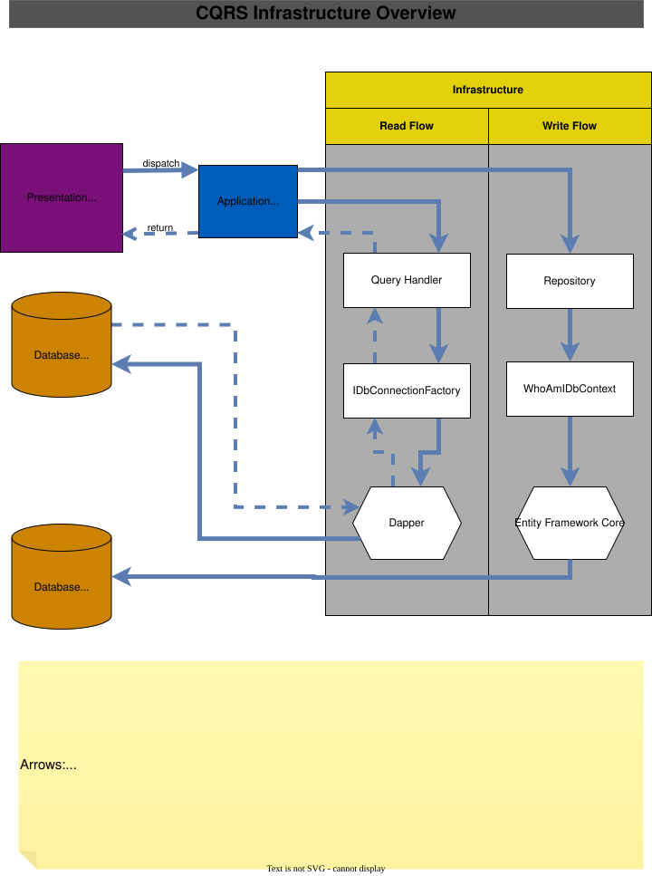
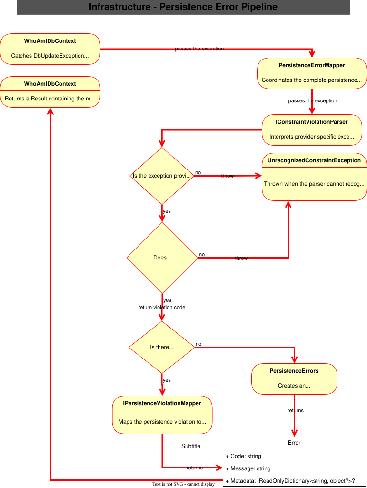

# WhoAmI.Infrastructure
## Introduction

The **WhoAmI.Infrastructure** project contains all infrastructure-specific implementations used by the application.

Its primary responsibility is to provide implementations for the abstractions defined by the Application layer while keeping technology-specific concerns isolated from the rest of the solution.

The project follows the principles of [**Clean Architecture**](https://blog.cleancoder.com/uncle-bob/2012/08/13/the-clean-architecture.html), [**Domain-Driven Design (DDD)**](https://www.domainlanguage.com/), and [**SOLID**](http://butunclebob.com/ArticleS.UncleBob.PrinciplesOfOod), ensuring that business logic remains independent of persistence details.

---

## Architectural Principles

The Infrastructure project is designed according to the principles of:

- Clean Architecture
- Domain-Driven Design (DDD)
- SOLID

Technology-specific concerns remain isolated within the Infrastructure layer through well-defined abstractions. Components have focused responsibilities and are designed to be extended without modifying existing implementations, making it straightforward to introduce new persistence providers, query implementations, or persistence violation mappings while keeping the Domain and Application layers independent of infrastructure details.

---

## Responsibilities

The Infrastructure layer is responsible for:

- Configuring the database model
- Implementing repositories
- Persisting aggregates
- Translating provider-specific persistence errors
- Registering infrastructure services
- Executing SQL queries

It is **not** responsible for business rules.

Business validation belongs to the Domain and Application layers.

---

## Project Structure

The `Data` folder is divided into two primary areas:

- **Persistence**, which contains the write-side implementation.
- **Queries**, which contains the read-side implementation.

### Persistence

This is the **Persistence** structure:

```text
WhoAmI.Infrastructure/
└── Data/
    └── Persistence/
        ├── Configurations/
        ├── Context/
        ├── ErrorHandling/
        └── Repositories/
```

**Persistence** is responsible for persisting aggregates and other write operations against the database.


#### Configurations

This folder contains:
- The Entity Framework model configurations that defines:
  - tables;
  - columns;
  - indexes;
  - conversions;
  - owned types;
  - database constraints.

  > These classes contain only persistence mapping.
  > No business logic belongs here.

- Database constraint names are centralized in the class `/Configurations/Constraints/DatabaseConstraintNames.cs`.
  - This avoids duplicated string literals throughout the persistence configuration.

  > These constants are used only when configuring the database schema for unique indexes or unique constraints.


#### Context

Contains the EF Core DbContext.

Its responsibilities include:

- exposing DbSets;
- applying configurations;
- configuring interceptors;
- acting as the Unit of Work implementation.


#### Repositories

Repositories implement the repository interfaces defined by the Application layer.

Their responsibility is limited to persisting aggregates.

Business rules are intentionally kept outside repositories.

---

### Queries

This is the **Queries** structure:

```text
WhoAmI.Infrastructure/
└── Data/
    └── Queries/
        ├── Abstractions/
        ├── Connections/
        └── Features/
```

The query side is separated from aggregate persistence.

This allows read operations to evolve independently of write operations.

Although the current implementation uses SQLite, the structure allows replacing the query technology without affecting the rest of the application.

Future implementations may use different technologies without impacting the **Domain** or **Application** layers.

#### Connections

Responsible for creating database connections used by query handlers.

This isolates connection creation behind the abstraction `IDbConnectionFactory`.

#### Features

##### Query Handlers

Each query resides in its own folder, organized by feature and aggregate.

Example:

```text
WhoAmI.Infrastructure/
└── Data/
    └── Queries/
        ├── Abstractions/
        ├── Connections/
        └── Features/
            └── Profiles
                └── GetProfileByEmail
                    ├── GetProfileByEmailQueryHandler.cs
                    ├── GetProfileByEmailRow.cs
                    └── GetProfileByEmailSql.cs
```

Keeping SQL close to its handler improves discoverability and keeps related code together.

Each query typically contains:

- SQL definition
- Row model (DTO)
- Query handler

---

## CQRS Infrastructure Overview

The following diagram illustrates how the Infrastructure project supports the Command (write) and Query (read) sides of the application.

Although both flows ultimately interact with the same SQLite database today, they are intentionally separated so that each side can evolve independently. This separation allows different persistence strategies, read models, or even dedicated databases to be introduced in the future without affecting the Application or Domain layers.

The following diagram summarizes how the write and read sides are implemented inside the Infrastructure layer.

<p align="center">
  
</p>

---

## Persistence Error Handling

One of the goals of this project is preventing database-specific details from escaping the Infrastructure layer.

The error handling is designed to translate provider-specific persistence errors into provider-independent persistence violation codes and, ultimately, application errors.

This approach prevents SQLite, SQL Server, PostgreSQL, or any other provider-specific implementation details from leaking into the Application layer.

For example, SQLite generates provider-specific exceptions containing messages such as:

```
UNIQUE constraint failed: Profiles.email
```

The rest of the application should never depend on these messages.

Instead, Infrastructure translates them into provider-independent persistence violation codes and then maps them to application errors.

Below is shown the error handling structure:

```text
WhoAmI.Infrastructure/
└── Data/
    └── Persistence/
        └── ErrorHandling/
            ├── Abstractions/
            │   ├── IConstraintViolationParser.cs
            │   ├── IPersistenceErrorMapper.cs
            │   └── IPersistenceViolationMapper.cs
            ├── Exceptions/
            │   └── UnrecognizedConstraintException.cs
            ├── Parsers/
            │   └── Sqlite/
            │       ├── SqliteConstraintSignatures.cs
            │       └── SqliteConstraintViolationParser.cs
            ├── ViolationMappers/
            │   └── DuplicateProfileEmailViolationMapper.cs
            ├── PersistenceErrorMapper.cs
            └── PersistenceViolationCode.cs
```

---

### PersistenceErrorMapper

Coordinates the complete persistence error translation process.

The flow is:

1. Receive the provider exception.
2. Parse it.
3. Determine the persistence violation code.
4. Invoke the appropriate violation mapper.
5. Return the corresponding application error.

`WhoAmIDbContext` then wraps this `Error` in a failed `Result` and returns it to the Application layer.

The Application layer receives only the resulting application error and never depends on provider-specific exception details.

---

### Parsing

Parsers interpret provider-specific exceptions. Each database provider requires its own parser implementation.

For SQLite, the parser inspects the exception message and recognizes known constraint signatures.

Example: `Profiles.email` is translated into `DuplicateProfileEmail`.

No SQLite-specific information leaves this layer.

---

### PersistenceViolationCode

Represents provider-independent persistence violation codes.

Examples include:

- DuplicateProfileEmail
- DuplicateProfileGuid

These codes provide a provider-independent representation of persistence violations and are used to map provider-specific exceptions to application errors.

They intentionally do not reference:

- SQLite
- SQL Server
- PostgreSQL
- constraint names
- SQL messages

---

### Constraint Signatures

Contains the mapping between SQLite exception signatures and provider-independent violation codes.

The signature registry isolates all provider-specific knowledge in one place.

If another database provider is introduced in the future, it simply receives its own parser and signature registry.

---

### Violation Mappers

Violation mappers extract domain-relevant metadata from EF Core entities.

For example: `DuplicateProfileEmail` extracts `Email = john@example.com`

This metadata is used to produce rich, provider-independent application errors that can later be interpreted by the Application layer.

Each mapper has a single responsibility.

Adding support for a new persistence violation typically requires creating a new mapper without modifying existing ones, respecting the Open-Closed principle of [**SOLID**](http://butunclebob.com/ArticleS.UncleBob.PrinciplesOfOod).

---

### UnrecognizedConstraintException

Thrown when the parser cannot recognize a provider-specific persistence constraint or receives an unexpected exception type.

Failing fast prevents silent data inconsistencies and makes missing mappings immediately visible during development.

---

### Persistence Error Pipeline

The diagram below describes the persistence error handling step by step.

<p align="center">
  
</p>

---

## Dependency Injection

The `ServiceCollectionExtensions.cs` class registers all Infrastructure services.

Examples include:

- DbContext
- repositories
- persistence error handlers
- query services
- database connections

Applications only need to call a single extension method.

---

## Migrations

Contains Entity Framework Core migrations used to evolve the database schema over time.

Each migration represents a versioned set of schema changes, allowing the database structure to remain synchronized with the persistence model defined by the Infrastructure layer.

---

## Related Documentation

- [WhoAmI — Project Overview](../../README.md)
- [Architecture](../../docs/architecture/README.md)
- [WhoAmI.Application](../WhoAmI.Application/README.md)
- [WhoAmI.Bootstrap](../WhoAmI.Bootstrap/README.md)
- [WhoAmI.CLI](../WhoAmI.CLI/README.md)
- [WhoAmI.Domain](../WhoAmI.Domain/README.md)

---

## References

- [Domain-Driven Design](https://www.domainlanguage.com/) — Eric Evans
- [Clean Architecture](https://blog.cleancoder.com/uncle-bob/2012/08/13/the-clean-architecture.html) — Robert C. Martin
- [SOLID Principles](http://butunclebob.com/ArticleS.UncleBob.PrinciplesOfOod) — Robert C. Martin

---

Built with ❤️ on **Linux** using **JetBrains Rider**.

> “Cast all your anxiety on him because he cares for you.”
>
> — 1 Peter 5:7
